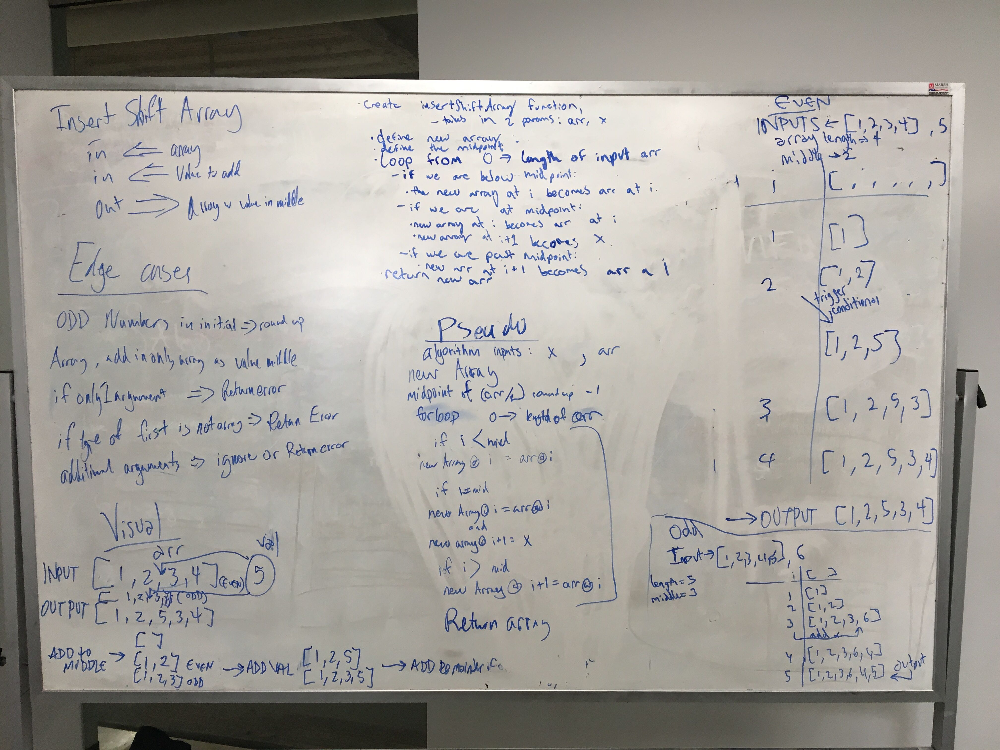

# Insert and shift middle index of array
Code challenge 02. 
Whiteboard completed with Aaron Ferris and Joseph Wolfe.

## Challenge
Must take in an array, then inserts the second input to the center of the array. It rounds up if it is an odd number.

## Approach & Efficiency

Initially, we wrote the function assuming that we could use the '.push' method of an array. After completing our solution, we refactored to eliminate the need for that method. Once we reached the mid point, our function adds the desired value to the correct spot, then continues to add values at the position after the iterated values. This works because our new array will always be one value longer than our initial array.

Big O: O(n)

Pull request: https://github.com/ChristopherKnightMerritt/data-structures-and-algorithms/pull/18

## Solution

