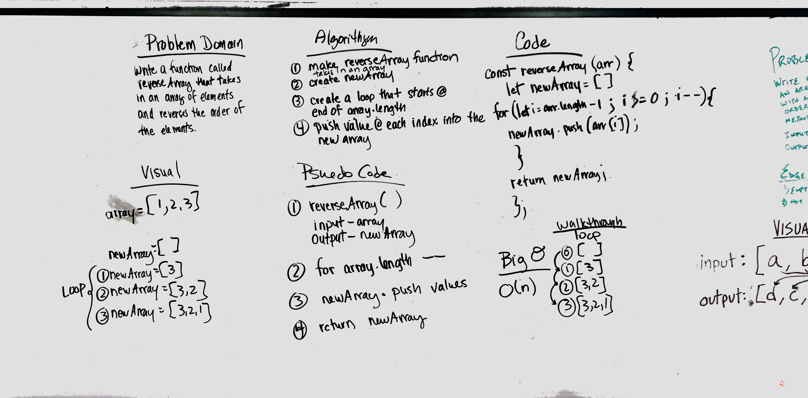

# Reverse an Array
<!-- Short summary or background information -->
Code challenge 01.

## Challenge
<!-- Description of the challenge -->
Write a function called reverseArray that takes in an array of elements and reverses the order.

## Approach & Efficiency
<!-- What approach did you take? Why? What is the Big O space/time for this approach? -->
We chose to make a new array, then loop from the end of the original array and push each value to the new array. 

## Solution
<!-- Embedded whiteboard image -->
