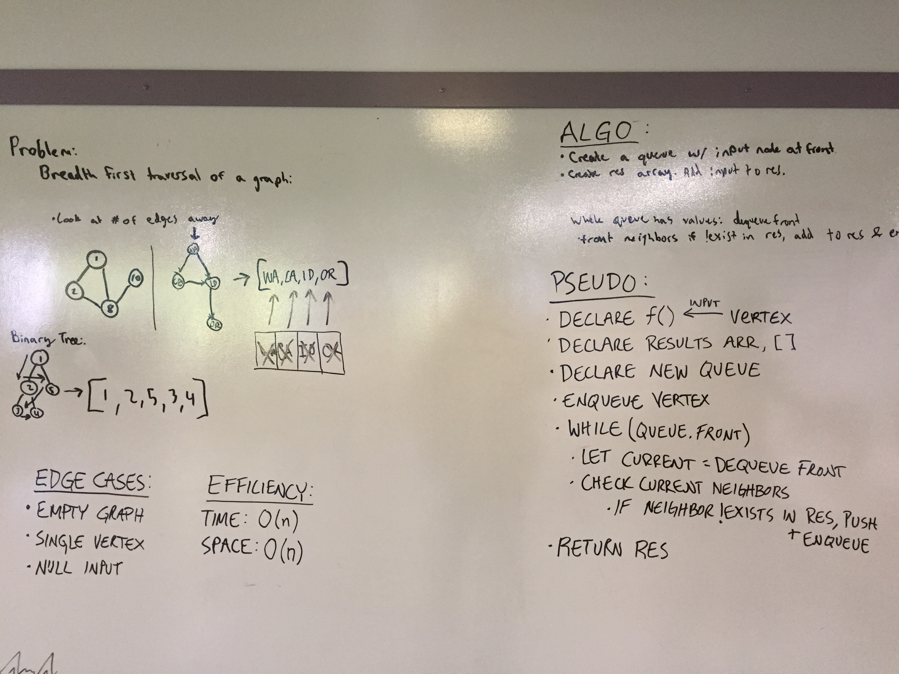

# Breadth-First Traversal of a Graph
A graph connects nodes together by linking their values. Values can have multiple edges or none.

## Challenge
Extend your graph object with a breadth-first traversal method that accepts a starting node. Without utilizing any of the built-in methods available to your language, return a collection of nodes in the order they were visited. Display the collection.

## Approach & Efficiency
My approach was to create a queue and a results array. Add the first value in the graph (that you are checking) to the queue and to the array. While the queue is not empty, you need to get the neighbors of the current value you are looking at. If the values of the neighbors are already in the list, then move on to the next. If it is not, then add it to the queue and to the array. Return the array.

## Solution

