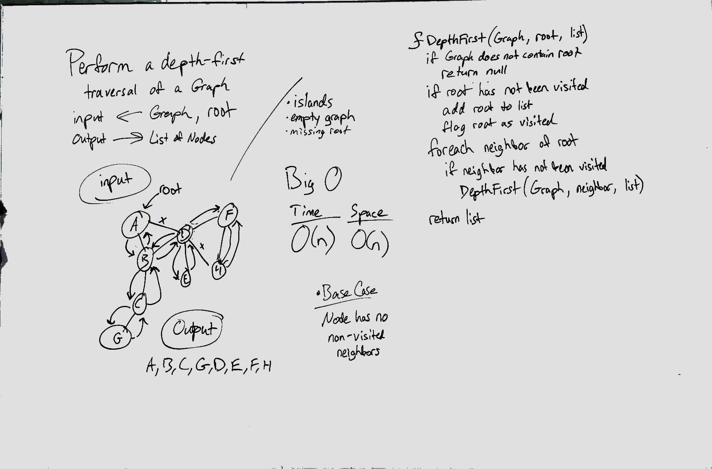

# Depth First Traversal
Conduct a depth first preorder traversal on a graph

## Challenge
Create a function that accepts an adjacency list as a graph, and conducts a depth first traversal. Without utilizing any of the built-in methods available to your language, return a collection of nodes in their pre-order depth-first traversal order.

## Approach & Efficiency
Our approach was to first check that we got the correct inputs. If the current root that we are checking has not been visited yet, add the value to the list then set visited to false. Then, for each of the neighbors of that root check if they have been visited. If they have not been visited, then call the depth first function again with that value as the root. Once the call stack is clear again, return the list.

## Solution

