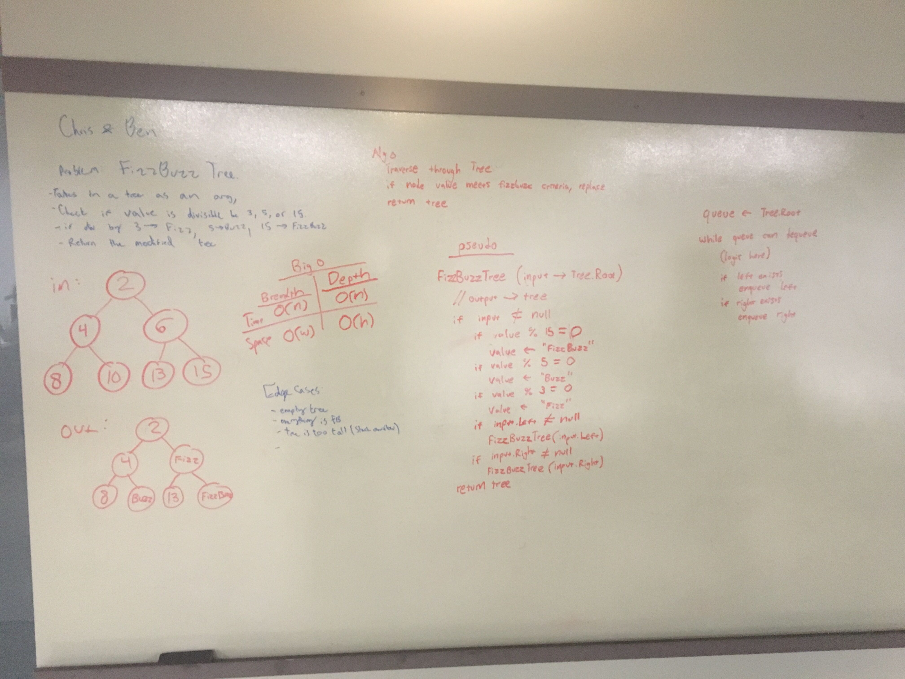

# FizzBuzz Tree
Takes in an existing tree, made up of nodes. FizzBuzz is a classic interview question.

## Challenge
Write a function called FizzBuzzTree which takes a tree as an argument.
Without utilizing any of the built-in methods available to your language, determine weather or not the value of each node is divisible by 3, 5 or both, and change the value of each of the nodes:
If the value is divisible by 3, replace the value with “Fizz”
If the value is divisible by 5, replace the value with “Buzz”
If the value is divisible by 3 and 5, replace the value with “FizzBuzz”
Return the tree with its new values.

## Approach & Efficiency
Our approach was to pass in the root node of a tree. Then, while the input is not null, check the current value to see if it is divisible by 15, 5, or 3. If it is, replace it with 'Fizzbuzz', 'Fizz', 'Buzz', respectivley. Then, recursivley call the function again with the current node. If there is a left child, use that. If there is a right child, use that. Finally, since we are mutating the original tree, return to end the function.

## Solution

