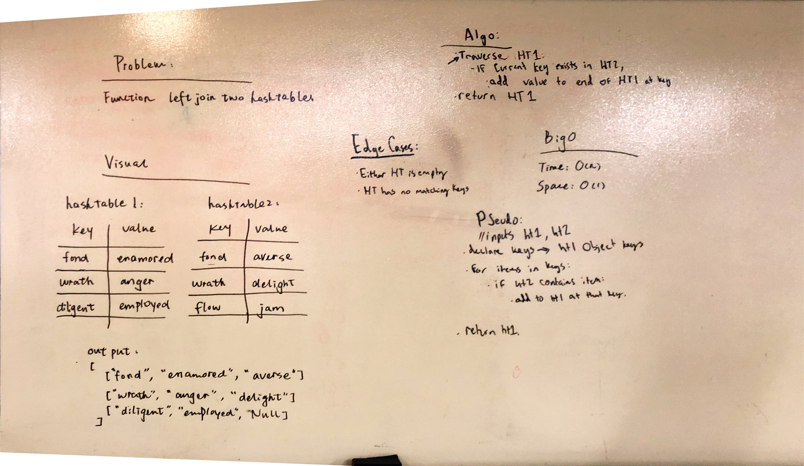

# Hashmap LEFT JOIN
A hashmap takes in a key value pair, then stores it in a linked list at the hashed value of the given key.

## Challenge
Write a function that LEFT JOINs two hashmaps into a single data structure.
The first parameter is a hashmap that has word strings as keys, and a synonym of the key as values.
The second parameter is a hashmap that has word strings as keys, and antonyms of the key as values.
Combine the key and corresponding values (if they exist) into a new data structure according to LEFT JOIN logic.
LEFT JOIN means all the values in the first hashmap are returned, and if values exist in the “right” hashmap, they are appended to the result row. If no values exist in the right hashmap, then some flavor of NULL should be appended to the result row.
The returned data structure that holds the results is up to you. It doesn’t need to exactly match the output below, so long as it achieves the LEFT JOIN logic.
Avoid utilizing any of the library methods available to your language.

## Approach & Efficiency
To solve this, we first need to iterate through each value in the left hashtable. If the current key exists in the second table, we need to add the value from the second table to the first table at the same key. Then return the left hashtable.

## Solution

