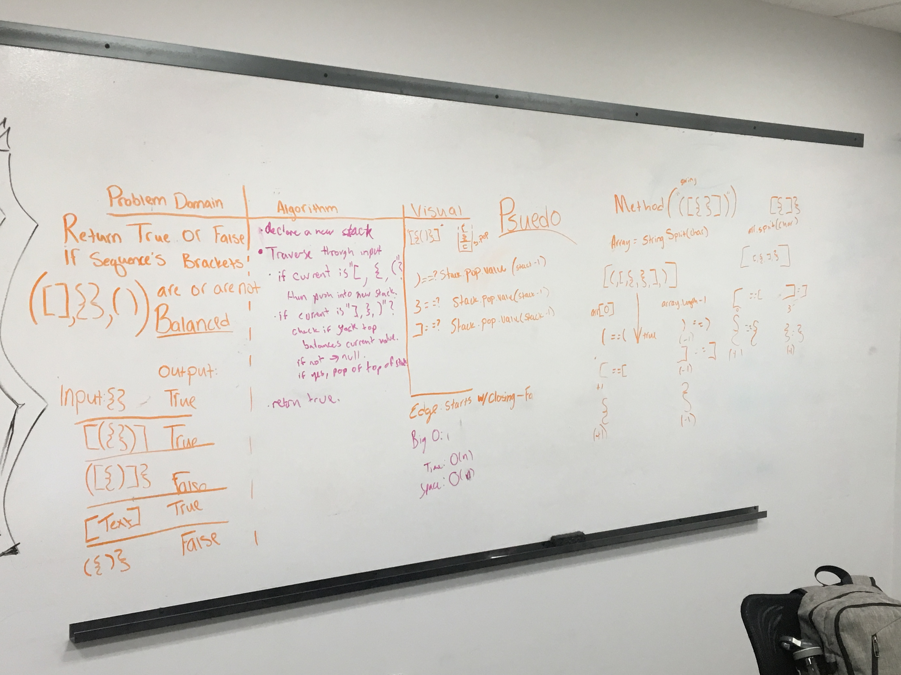

# Multi-bracket Validation.
To have a balanced bracket, it must have an equal closing character and can not be nested by a closing character of another type within it. 

## Challenge
Your function should take a string as its only argument, and should return a boolean representing whether or not the brackets in the string are balanced. There are 3 types of brackets:

Round Brackets : ()
Square Brackets : []
Curly Brackets : {}

## Approach & Efficiency
Our approach was to create a new stack, then iterate through our string. If we reach a character that is either `{`, `[`, or `(`, add that value to the stack, then iterate to the next value. If we come to a value that is either `}`, `]`, or `)`, check it against the first value on the stack. If it is the same type of bracket, pop it off the stack. If it not, return false. Once you reach the end, check if the stack is empty. If it is, then the string is balanced and return true. If it is not empty, return false.

## Solution

