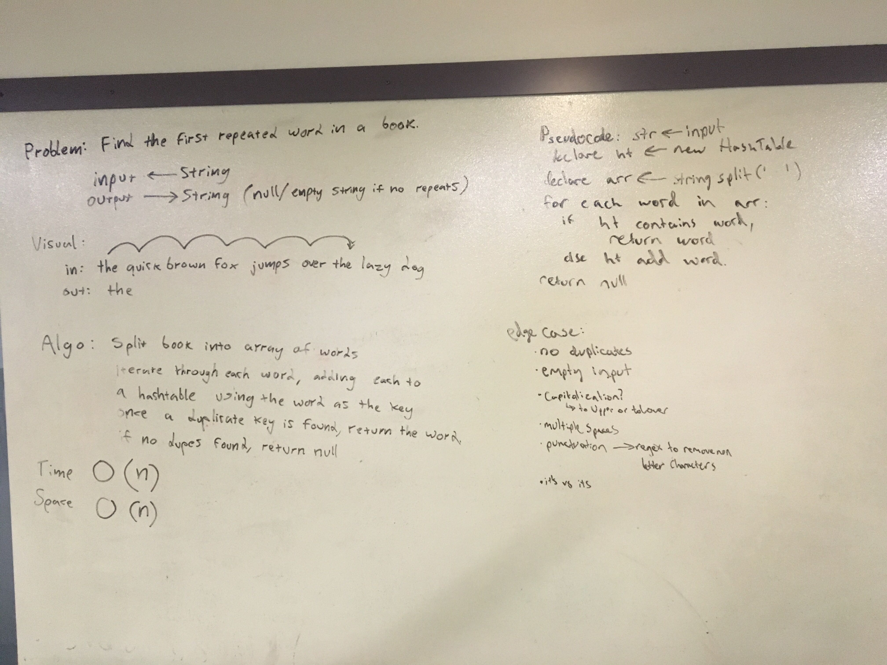

# First repeated word
Find the first repeated word in a book.

## Challenge
* Write a function that accepts a lengthy string parameter.
* Without utilizing any of the built-in library methods available to your language, return the first word to occur more than once in that provided string.

## Approach & Efficiency
My approach was to first create an array of all the values in the string, splitting them at the space. I then looped through that array and checked if that value existed already in the hash table. If it did, return that value as the first repeated word. Otherwise, add the value to the hash table. If there are no matches, return null.

## Solution

