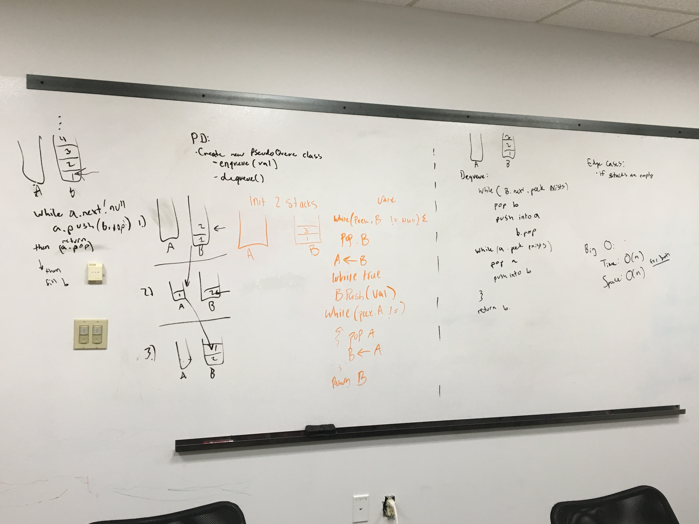

# Implement a Queue using two Stacks.
A stack is made up of nodes with a value property and a pointer property. The stacks have methods pop, push, and peek.

## Challenge
Create a brand new PseudoQueue class. Do not use an existing Queue. Instead, this PseudoQueue class will implement our standard queue interface (the two methods listed below), but will internally only utilize 2 Stack objects. Ensure that you create your class with the following methods:

* enqueue(value) which inserts value into the PseudoQueue, using a first-in, first-out approach.
* dequeue() which extracts a value from the PseudoQueue, using a first-in, first-out approach.

## Approach & Efficiency
First, I created a new class for PseudoQueue, with the properties aStack (the parameter), and bStack, which starts as null in the constructor. It has two methods:
* enqueue(val):
  Adds a new value to the front of the stack.
  
* dequeue():
  Removes the front value of the initial stack.

## Solution
* enqueue(val):
  This first checks while the initial stack still has values. If it does, pop it off, then push that val into the second stack.
  If it does not have any more values, create a new value in the initial stack. 
  Then, while the second stack still has values, pop of each value then push it onto the initial stack.

* dequeue():
  This first checks while the initial stack does not have a next value after the front. If it does, pop the current value off then push it to the second stack. Otherwise, pop that value off of the initial stack.
  Then, while the second stack has values, pop each value off then push them back onto the initial stack.

## UML:

