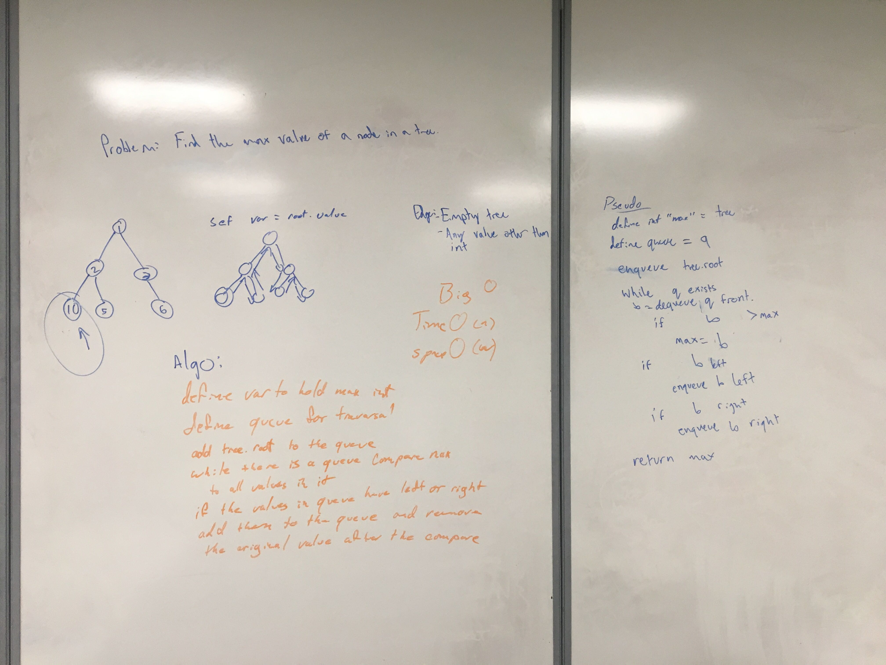

# Trees
Binary Trees are made up of nodes that have a value, a left, and a right property. A tree consists of a root, then edges that connect the nodes together.

## Challenge
Create a Node class that has properties for the value stored in the node, the left child node, and the right child node.
Create a BinaryTree class
Define a method for each of the depth first traversals called preOrder, inOrder, and postOrder which returns an array of the values, ordered appropriately.

Define a method named add that accepts a value, and adds a new node with that value in the correct location in the binary search tree.
Define a method named contains that accepts a value, and returns a boolean indicating whether or not the value is in the tree at least once.

## Approach & Efficiency
First, I created the node class that has a value, a left and a right property.

Next, I created my BST class and gave it a property of root, which was null. I created the method to add values to the tree.

add(val):
  First I created a new node to add the tree once I found the right spot for it. Then I iterated through the tree and checked if the input value was less than the left value. If it was, then that meant we would be checking the left side. If the pointer is to null, then insert the new node. Otherwise, theck with the next value in the tree. Then do the same check on the right side.

contains(val):
  Iterate through the list, and check if the current value is equal to the input value. If it is not, then search though either the right child if it is larger or the left child if it is smaller.

preOrder(node)/inOrder(node)/postOrder(node):
  While the node still has value, find the smallest value, then add it to the array. Then search through by calling the preorder function again with recursion. The difference between the functions is in when the value gets pushed to the array.

findMax(tree): 
  This function takes in a tree, so it could not use recursion. By using breadth first traversal, we can add each node to a queue, then compate its value then compare it to the current largest and take the largest value. If it has any children then add them to the queue.

## API
Available functions:
* add(val)
* contains(val)
* preOrder(node)
* inOrder(node)
* postOrder(node)
* findMax(tree)

Whiteboard 4/10:

